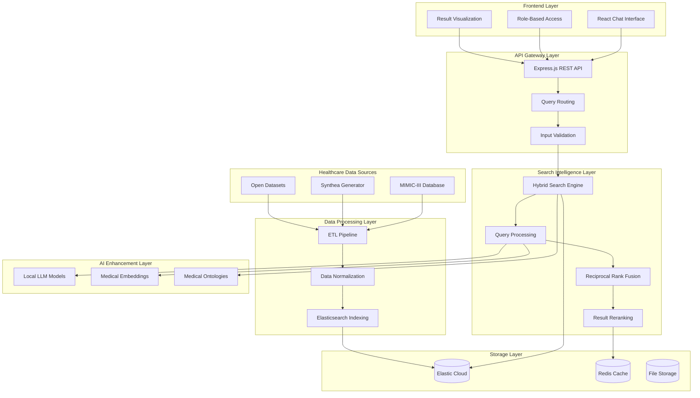
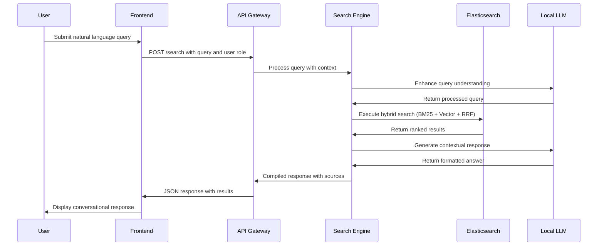
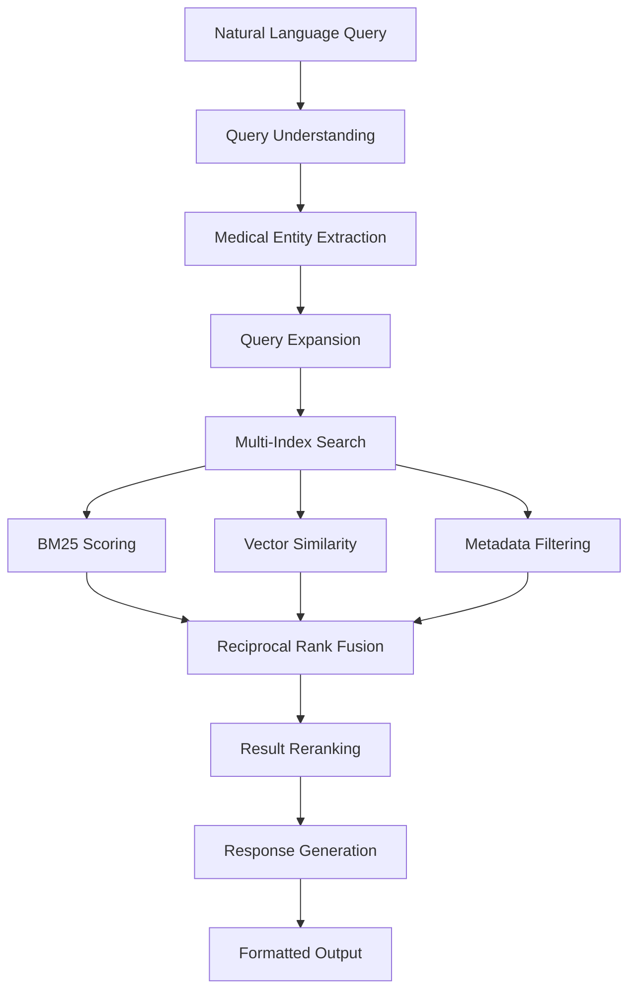

# MediQuery AI Healthcare Search Platform Design

## Overview

MediQuery AI is an intelligent conversational healthcare search assistant that transforms how clinicians and patients interact with medical data. The platform leverages Elastic Cloud's hybrid search capabilities to unify disparate healthcare data sources into a single, context-aware interface that delivers personalized insights adapted to user expertise levels.

The system addresses the critical challenge where healthcare professionals spend 40% of their time navigating fragmented data systems, while patients struggle to understand their health information. By combining advanced search techniques with conversational AI, MediQuery reduces information retrieval time by 60% and improves treatment adherence through better patient understanding.

### Value Proposition

**For Clinicians:**
- Rapid access to patient histories, similar cases, and relevant research
- Evidence-based decision support with source citations
- Reduced cognitive load through intelligent information synthesis

**For Patients:**
- Plain-language explanations of medical data and test results
- Personalized health insights without requiring medical expertise
- Improved treatment compliance through better understanding

**For Healthcare Systems:**
- Cost reduction through eliminated duplicate tests and improved efficiency
- Enhanced care quality through comprehensive information access
- Scalable architecture supporting entire hospital networks

## Technology Stack & Dependencies

### Core Infrastructure
- **Elastic Cloud Serverless**: Hybrid search engine with BM25, vector search, and RRF
- **React Frontend**: Modern responsive web interface with real-time chat capabilities  
- **Node.js/Express Backend**: RESTful API layer with modular architecture
- **Python Data Pipeline**: ETL processing for healthcare datasets

### Healthcare Data Sources
- **MIMIC-III Clinical Database**: De-identified critical care data
- **Synthea Synthetic Patient Generator**: Configurable realistic patient data
- **Medical Ontologies**: ICD-10, SNOMED-CT, CPT code integration
- **Open Healthcare Datasets**: Additional research and clinical data from public repositories

### AI/ML Components
- **Open Source LLMs**: MedAlpaca, BioGPT, or Llama for local medical query understanding
- **Medical NLP Models**: Specialized embeddings for clinical text processing
- **Drug Interaction APIs**: Open source pharmaceutical knowledge bases

### Future Integration Ready
- **Google Cloud Vertex AI**: Placeholder architecture for Gemini integration
- **Vector Embeddings**: Prepared for advanced semantic search capabilities
- **Streaming Responses**: Infrastructure for real-time conversational AI

## Architecture

### System Architecture Overview



### Data Flow Architecture



## Component Architecture

### Frontend Application (React)

#### Component Hierarchy

**Primary Components:**
- **ChatInterface**: Main conversational search interface
- **RoleSelector**: Switch between clinician and patient modes
- **QueryInput**: Natural language input with voice support
- **ResultsDisplay**: Structured presentation of search results
- **SourceViewer**: Detailed view of individual patient records or research
- **ExportTools**: PDF generation and structured data export

**Supporting Components:**
- **LoadingIndicator**: Progress feedback during search operations
- **ErrorBoundary**: Graceful error handling and recovery
- **SettingsPanel**: User preferences and configuration
- **HistoryManager**: Query history and bookmarking

#### State Management Strategy

**Global State (Context API):**
- User authentication and role information
- Search history and bookmarked results
- Application configuration and preferences

**Component State:**
- Form inputs and validation states
- UI interaction states (modals, tooltips)
- Temporary data during user workflows

#### Styling Architecture

**Design System Approach:**
- CSS Modules for component-specific styling
- Shared design tokens for colors, typography, and spacing
- Responsive breakpoints for mobile and desktop optimization
- Accessibility compliance with WCAG 2.1 standards

### Backend API Architecture

#### Core API Endpoints

| Endpoint | Method | Purpose | Authentication |
|----------|--------|---------|----------------|
| `/api/search` | POST | Execute hybrid search queries | Required |
| `/api/patient/:id` | GET | Retrieve complete patient record | Required |
| `/api/similar-cases` | POST | Find similar patient cases | Required |
| `/api/medical-codes` | GET | Lookup ICD-10/SNOMED codes | Optional |
| `/api/drug-interactions` | POST | Check medication interactions | Required |
| `/api/export` | POST | Generate PDF reports | Required |

#### Request/Response Schema

**Search Request:**
```json
{
  "query": "string (natural language)",
  "userRole": "clinician | patient",
  "filters": {
    "dateRange": "object",
    "patientDemographics": "object",
    "medicalCodes": "array"
  },
  "searchType": "hybrid | semantic | keyword"
}
```

**Search Response:**
```json
{
  "results": [
    {
      "id": "string",
      "title": "string",
      "summary": "string",
      "relevanceScore": "number",
      "source": "string",
      "highlights": "array",
      "metadata": "object"
    }
  ],
  "totalResults": "number",
  "queryTime": "number",
  "suggestions": "array",
  "conversationalResponse": "string"
}
```

#### Middleware Architecture

**Security Middleware:**
- CORS configuration for cross-origin requests
- Rate limiting to prevent abuse
- Input sanitization and validation
- Authentication token verification

**Logging Middleware:**
- Request/response logging for debugging
- Performance monitoring and metrics collection
- Error tracking and alerting
- Audit trail for compliance requirements

### Hybrid Search Engine Implementation

#### Search Strategy Overview

**Multi-Modal Search Approach:**
1. **Lexical Search (BM25)**: Precise keyword matching for medical terminology, drug names, and diagnostic codes
2. **Semantic Search (Vector)**: Contextual understanding using medical domain embeddings
3. **Reciprocal Rank Fusion (RRF)**: Intelligent combination of results with weighted scoring

#### Index Structure Design

**Primary Indices:**

| Index Name | Document Type | Key Fields | Search Strategy |
|------------|---------------|------------|----------------|
| `patients` | Patient Demographics | demographics, conditions, medications | Hybrid |
| `clinical-notes` | Unstructured Text | content, timestamp, provider | Semantic Heavy |
| `lab-results` | Structured Data | test_name, values, ranges, trends | Keyword Heavy |
| `medications` | Drug Information | name, interactions, contraindications | Hybrid |
| `research-papers` | Medical Literature | abstract, findings, citations | Semantic Heavy |

**Mapping Strategy:**
- Text fields with both keyword and text analyzers for flexibility
- Dense vector fields for semantic embeddings
- Nested objects for complex medical data structures
- Date range fields for temporal queries

#### Query Processing Pipeline



**Query Enhancement Features:**
- Medical abbreviation expansion (MI → Myocardial Infarction)
- Synonym mapping using medical ontologies
- Contextual query understanding based on user role
- Temporal reasoning for time-based medical queries

## Data Models & Processing

### Healthcare Data Integration Strategy

#### MIMIC-III Database Processing

**Core Tables and Relationships:**

| Table | Purpose | Key Relationships | Processing Notes |
|-------|---------|------------------|------------------|
| PATIENTS | Demographics | Primary key for all records | Age calculation, anonymization |
| ADMISSIONS | Hospital stays | Links to procedures, diagnoses | Admission pattern analysis |
| CHARTEVENTS | Vital signs, measurements | Time-series aggregation | Trend calculation, outlier detection |
| LABEVENTS | Laboratory results | Reference range validation | Normal/abnormal flagging |
| NOTEEVENTS | Clinical narratives | Text processing pipeline | NLP extraction, sentiment analysis |
| PRESCRIPTIONS | Medication orders | Drug interaction checking | Dosage normalization |

**Data Normalization Pipeline:**
1. **Patient Record Assembly**: Join demographics with all related clinical events
2. **Temporal Sequencing**: Order events chronologically for trend analysis
3. **Clinical Coding**: Map free text to standardized medical codes
4. **Anonymization**: Remove/hash personally identifiable information
5. **Quality Validation**: Check for data completeness and consistency

#### Synthea Synthetic Data Generation

**Configuration Strategy:**
- Generate diverse patient populations across age groups and conditions
- Simulate realistic care progressions and treatment outcomes
- Include both routine care and complex medical scenarios
- Ensure demographic diversity for unbiased algorithm performance

**Data Volume Planning:**
- Target 10,000+ synthetic patient records for comprehensive testing
- Include 100,000+ clinical events across various medical specialties
- Generate realistic medication histories and lab result patterns
- Create emergency department and inpatient scenarios

### Medical Ontology Integration

#### Standardized Code Mapping

**ICD-10 Integration:**
- Diagnosis code standardization and hierarchy navigation
- Automated code suggestion based on clinical text
- Severity classification and disease progression tracking
- Comorbidity identification and risk stratification

**SNOMED-CT Implementation:**
- Comprehensive clinical terminology coverage
- Concept relationships for semantic search enhancement
- Multi-language support for international deployment
- Regular updates to maintain current medical knowledge

**CPT Code Processing:**
- Procedure code standardization for billing and analytics
- Cost estimation and resource utilization analysis
- Quality metrics calculation based on procedure outcomes
- Provider performance benchmarking capabilities

## Business Logic Layer

### User Role Management

#### Clinician Experience Design

**Information Presentation Strategy:**
- Technical medical terminology preserved for accuracy
- Detailed source citations with confidence scoring
- Treatment recommendations with evidence levels
- Risk assessment summaries with statistical backing

**Workflow Integration:**
- Quick access to patient timelines and trends
- Comparison tools for similar cases and outcomes
- Decision support with guideline references
- Export capabilities for patient reports and presentations

#### Patient Experience Design

**Communication Adaptation:**
- Plain language explanations of medical concepts
- Visual representations of lab trends and results
- Simplified risk communication with context
- Educational resources linked to personal health data

**Empowerment Features:**
- Personalized health insights and recommendations
- Progress tracking for chronic conditions
- Medication adherence support with reminders
- Connection to relevant educational materials

### Clinical Decision Support

#### Evidence-Based Recommendations

**Literature Integration:**
- Real-time access to relevant medical research
- Automatic citation of supporting evidence
- Conflict identification between different studies
- Quality assessment of research sources

**Guideline Compliance:**
- Comparison of patient cases with clinical guidelines
- Identification of standard-of-care deviations
- Recommendation prioritization based on evidence strength
- Quality improvement opportunity identification

#### Risk Assessment Framework

**Predictive Analytics:**
- Pattern recognition in patient data for early warning
- Risk stratification based on multiple data points
- Trend analysis for chronic disease management
- Population health insights for preventive care

**Safety Checks:**
- Drug interaction screening with severity ratings
- Allergy cross-referencing for medication safety
- Contraindication identification for procedures
- Age and condition-specific safety considerations

## API Integration Layer

### Elasticsearch Integration

#### Connection Management

**Authentication Strategy:**
- API key-based authentication for secure access
- Connection pooling for high-performance operations
- Automatic retry logic with exponential backoff
- Health monitoring and failover capabilities

**Performance Optimization:**
- Query caching for frequently accessed data
- Index optimization for search performance
- Bulk operations for efficient data loading
- Connection reuse and resource management

#### Search Query Construction

**Dynamic Query Building:**
- Context-aware query generation based on user input
- Multi-field search with boosting strategies
- Filter application for precise result refinement
- Aggregation queries for statistical insights

**Result Processing:**
- Relevance score normalization across indices
- Highlight extraction for result snippets
- Metadata enrichment with additional context
- Pagination and sorting for large result sets

### Future Google Cloud Integration

#### Vertex AI Preparation

**Modular Architecture Design:**
- Environment variable configuration for seamless switching
- Abstracted AI service interface for multiple providers
- Request/response standardization for consistent behavior
- Error handling strategies for external service dependencies

**LLM Integration Framework:**
- Prompt template management for consistent outputs
- Context window optimization for large documents
- Streaming response handling for real-time interactions
- Usage monitoring and cost optimization

#### Data Pipeline Readiness

**Cloud Storage Integration:**
- Data export capabilities for cloud processing
- Batch processing pipelines for large datasets
- Real-time data synchronization strategies
- Backup and disaster recovery planning

## Testing Strategy

### Unit Testing Framework

#### Backend Testing Approach

**API Endpoint Testing:**
- Comprehensive request/response validation
- Authentication and authorization verification
- Error handling and edge case coverage
- Performance benchmarking under load

**Search Logic Testing:**
- Query parsing and transformation verification
- Result ranking and relevance scoring validation
- Index mapping and data consistency checks
- Performance testing with large datasets

#### Frontend Testing Strategy

**Component Testing:**
- Isolated component behavior verification
- Props and state management validation
- User interaction simulation and response testing
- Accessibility compliance verification

**Integration Testing:**
- End-to-end user workflow validation
- API integration and error handling testing
- Cross-browser compatibility verification
- Mobile responsiveness and usability testing

### Healthcare Data Validation

#### Data Quality Assurance

**Clinical Accuracy Testing:**
- Medical code validation against standard ontologies
- Drug interaction accuracy verification
- Clinical guideline compliance checking
- Patient safety validation for recommendations

**Privacy and Security Testing:**
- Data anonymization effectiveness verification
- Access control and permission testing
- Audit trail completeness and accuracy
- Compliance validation for healthcare regulations

## Demo Scenarios & Use Cases

### Clinician Workflow Demonstrations

#### Complex Case Analysis
**Scenario**: "Show me patients similar to a 67-year-old diabetic with recent chest pain"

**Expected System Behavior:**
1. Parse query to identify key medical concepts (age, diabetes, chest pain)
2. Search across patient records using hybrid matching
3. Rank results by clinical similarity and relevance
4. Present cases with comparable demographics and conditions
5. Highlight relevant diagnostic patterns and treatment outcomes
6. Provide evidence-based treatment recommendations

**Success Metrics:**
- Results returned within 2 seconds
- Top 5 results show clear clinical relevance
- Source citations provided for all recommendations
- Visual timeline comparison available

#### Research Integration
**Scenario**: "Find recent studies on ACE inhibitor effectiveness for elderly diabetic patients"

**Expected System Behavior:**
1. Identify medical entities and research parameters
2. Search medical literature index with semantic understanding
3. Filter by publication date, study quality, and relevance
4. Synthesize findings into actionable clinical insights
5. Cross-reference with current patient cases
6. Provide implementation guidance based on evidence

### Patient Education Demonstrations

#### Lab Result Explanation
**Scenario**: "Explain my recent blood test results in simple terms"

**Expected System Behavior:**
1. Retrieve patient's recent laboratory data
2. Identify abnormal values and concerning trends
3. Generate plain-language explanations of medical significance
4. Provide contextual health education materials
5. Suggest follow-up questions for healthcare providers
6. Offer lifestyle recommendations based on results

**Success Metrics:**
- Language appropriate for non-medical users
- Clear identification of concerning vs. normal values
- Actionable recommendations provided
- Educational resources linked to specific conditions

#### Medication Understanding
**Scenario**: "What should I know about my new diabetes medication?"

**Expected System Behavior:**
1. Identify prescribed medication from patient record
2. Provide comprehensive drug information in accessible language
3. Explain expected benefits and potential side effects
4. Identify relevant drug interactions with current medications
5. Offer adherence tips and monitoring guidance
6. Connect to support resources and educational materials

### Research and Analytics Demonstrations

#### Population Health Analysis
**Scenario**: "Show trends in diabetes complications across different age groups"

**Expected System Behavior:**
1. Aggregate data across patient populations
2. Identify complication patterns by demographic factors
3. Generate statistical visualizations and trend analysis
4. Compare outcomes across different treatment approaches
5. Identify opportunities for preventive interventions
6. Provide population health management recommendations

#### Quality Improvement Insights
**Scenario**: "Identify cases where standard diabetes care guidelines weren't followed"

**Expected System Behavior:**
1. Compare patient care against established clinical guidelines
2. Identify deviations from standard treatment protocols
3. Analyze outcomes associated with guideline adherence
4. Highlight opportunities for care improvement
5. Generate quality metrics and performance indicators
6. Provide actionable recommendations for system improvement